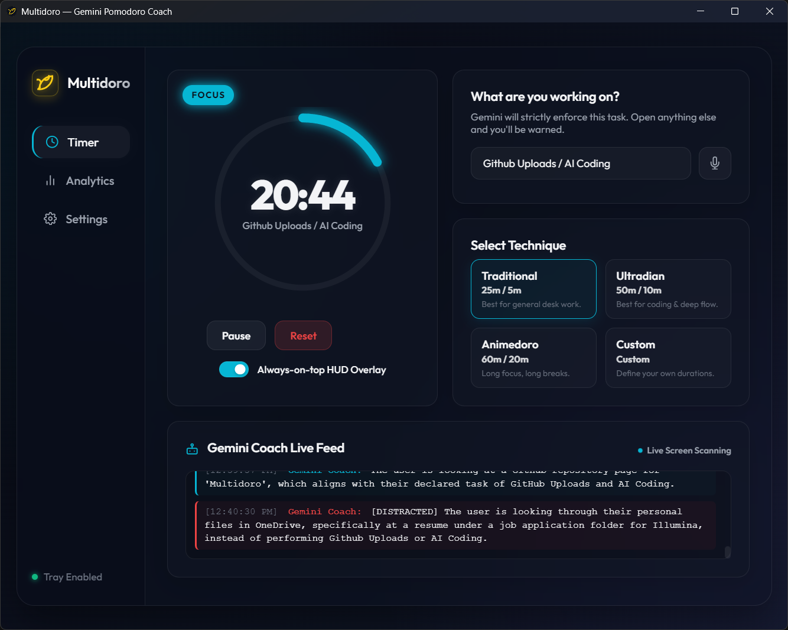
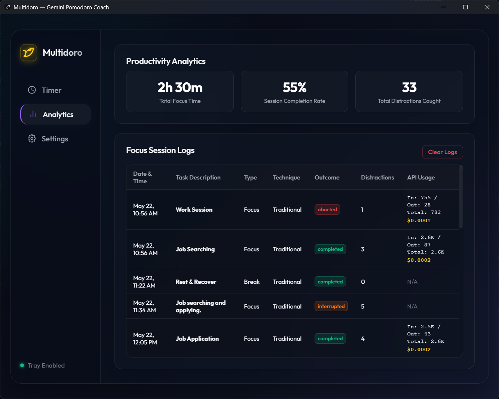
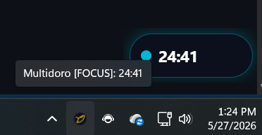

# 🍅 Multidoro

Multidoro is a state-of-the-art, glassmorphic desktop Pomodoro application built with **Electron, TypeScript, and HTML5/Vanilla CSS**. It integrates stateless **Gemini HTTP APIs** to act as a real-time visual work coach—monitoring your active screen and speaking warnings out loud if you get distracted from your declared task.

<p align="left">
  <a href="https://github.com/msounhein/Multidoro/releases">
    
  </a>
</p>

---

## 📸 Screenshots

| Main Dashboard | Analytics Logs & Settings | System Tray Menu |
|---|---|---|
|  |  |  |

---

## ✨ Features

- **🧠 Real-Time AI Coaching**: Uses stateless Gemini APIs (**Gemini 3.5 Flash** or **Gemini 3.1 Pro**) to analyze screenshots of your active screen against your declared task under a structured JSON schema.
- **🔊 Voice Feedback**: Generates on-demand verbal scoldings (via **Gemini 3.1 Flash TTS**) using multiple selectable voices (`Zephyr`, `Puck`, `Aoede`, etc.) to keep you strictly on-task.
- **🎙️ Speech-to-Text Task Input**: Dictate your current task hands-free using built-in speech recognition.
- **⏱️ Flexible Pomodoro Techniques**:
  - *Traditional*: 25m focus / 5m break.
  - *Ultradian*: 50m focus / 10m break (ideal for deep work).
  - *Animedoro*: 60m focus / 20m break.
  - *Custom*: Configure your own focus and break durations.
- **🖥️ Smart HUD Overlay**: A floating, always-on-top overlay widget automatically positioned in the bottom-right corner of your screen (safely above the taskbar) displaying remaining time and distraction state.
- **📊 Offline SQLite Database**: Uses a WebAssembly-based SQLite database (`sql.js`) to persist session logs, completion rates, and distraction events locally.
- **🔒 Encrypted API Credentials**: Encrypts your Gemini API key at rest using Electron's native `safeStorage` API.
- **🎨 Premium Dark Glassmorphic UI**: Beautiful responsive layout with glowing neon indicators, custom glossy scrollbars, and dynamic inline vector SVG icons.

---

## 🛠️ Architecture

- **Main Process (`src/main.ts`)**: Controls window lifecycles, global tray setup, screen captures, native Windows balloon notifications, encrypted offline settings storage, and stateless API calls to Gemini.
- **Renderer Process (`src/renderer/renderer.ts`)**: Handles DOM actions, tab navigation, timer counting state, speech recognition, audio playback of on-demand TTS audio chunks, and rendering analytics charts.
- **Database Layer (`src/database.ts`)**: Initializes tables for settings, sessions, and distractions offline in SQLite WASM and runs automated migrations.
- **Preload Script (`src/preload.ts`)**: Exposes IPC channels securely between the Electron main process and the front-end renderer.

---

## 🚀 Download & Installation

### 💾 Standalone Releases (Windows)
For non-developers or quick setups, download the pre-compiled executables from the [GitHub Releases](https://github.com/msounhein/Multidoro/releases) page:
* **Portable Version (`Multidoro.1.0.0.exe`)**: Runs instantly without installation.
* **Installer Version (`Multidoro.Setup.1.0.0.exe`)**: Installs the app to your system, adding it to your desktop and Start Menu.

### 🛠️ Developer Setup & Installation (From Source)

#### Prerequisites
- [Node.js](https://nodejs.org/) (v16+)
- A **Gemini API Key** (obtainable from Google AI Studio)

#### 1. Clone & Install
```bash
# Clone the repository
git clone https://github.com/msounhein/Multidoro.git
cd multidoro

# Install dependencies
npm install
```

#### 2. Configure API Key
Launch the application and paste your API key directly inside the **Settings** tab. The key will be encrypted and saved securely locally.

#### 3. Build & Start
```bash
# Compile TypeScript and copy asset files
npm run build

# Start the application
npm start
```

---

## ⌨️ Development Commands

- `npm run build`: Compiles TS code and copies static renderer assets (HTML, CSS, templates, and WASM binary) to the `dist/` build output directory.
- `npm start`: Launches the compiled Electron binary.
- `npm run dev`: Optional watch script for compiling code during active development.

---

## 🛡️ License

This project is licensed under the MIT License.
