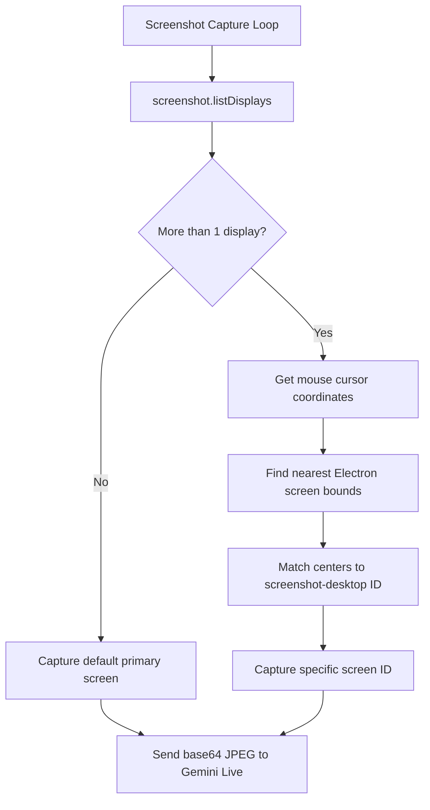

# Multi-Monitor Active Screen Tracking Design Spec

**Date**: 2026-05-21  
**Goal**: Handle multiple monitors dynamically by detecting and capturing only the screen the user is actively working on (nearest to their mouse cursor).

---

## 📐 Architecture & Logic

When a focus session is active, the screenshot loop executes at regular intervals. If multiple screens are detected, the app will:
1. Fetch all connected screen properties from `screenshot-desktop`.
2. Query the current cursor location using Electron's `screen` API.
3. Identify the nearest Electron display.
4. Match coordinates between the Electron display and `screenshot-desktop` targets.
5. Capture only the matched display to send to the Gemini Live Coach.

---

## 🛠 Proposed Changes

### [Component: Electron Main Process]

#### [MODIFY] [main.ts](file:///c:/Users/MSounhein/OneDrive/Documents/Code/multidoro/src/main.ts)
* Add coordinate center-matching logic inside `runScreenshotCheck()`.
* Map Electron's `screen.getDisplayNearestPoint` to `screenshot-desktop` display IDs.
* Execute `screenshot` with the matching screen ID parameter.

---

## 🔍 Verification Plan

### Automated/Build Verification
* Run `npm run build` to verify there are no TypeScript compiler errors.

### Manual Verification
1. Move the mouse cursor to Screen 1. Focus on the target task. Observe logs showing Screen 1 ID is captured.
2. Move the mouse cursor to Screen 2. Observe logs showing Screen 2 ID is captured dynamically on the next tick.
3. Open a distraction on Screen 2. Move the mouse to Screen 2. Verify that Gemini correctly triggers the alarm and speaks the scolding warning.
