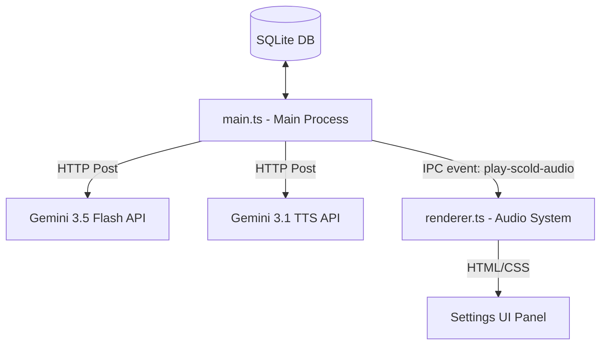

# Design Spec: Stateless Screen Classification and On-Demand TTS Scolding

## Goal Description
Migrate the application's screenshot analysis and coach voice scolding loop from the legacy real-time WebSocket connection (Gemini Live) to a robust, stateless HTTP architecture using Google's new 2026 model family (`gemini-3.5-flash` and `gemini-3.1-flash-tts-preview`).

This refactoring solves:
* **High False Positives**: Upgrading the vision classifier from low-latency Flash Live to general-purpose `gemini-3.5-flash` or `gemini-3.1-pro-preview` provides vastly superior visual parsing and task adherence.
* **WebSocket Fragility**: Eliminates persistent connection maintenance, GoAway drops, and self-healing reconnect loops.
* **Vocal Variety**: Introduces setting preferences allowing the user to select from 30+ prebuilt Gemini TTS voice profiles (e.g., Puck, Kore, Aoede, Zephyr).
* **Code Complexity**: Simplifies token billing estimates, JSON fallback text parsers, and client-side binary buffer stream normalizations.

---

## Architectural Layout



### 1. Database & Settings Model Schema
We will update the local SQLite database schema ([database.ts](file:///c:/Users/MSounhein/OneDrive/Documents/Code/multidoro/src/database.ts)) settings table to store two new configuration values:
* `geminiModel`: Text field. Value options: `gemini-3.5-flash` (default) or `gemini-3.1-pro-preview`.
* `voiceName`: Text field. Value options: `Zephyr` (default), `Aoede`, `Kore`, `Puck`, `Charon`, or `Fenrir`.

### 2. Main Process Classification Loop ([main.ts](file:///c:/Users/MSounhein/OneDrive/Documents/Code/multidoro/src/main.ts))
* Delete WebSocket configuration blocks, the `connectGemini` / `disconnectGemini` socket event handlers, and token accumulation state hacks.
* Introduce a stateless `runScreenClassification()` check function scheduled by a recursive `setTimeout` loop.
* At every scan tick, it will:
  1. Capture the screen via `captureScreen(targetDisplayId)`.
  2. Call `ai.models.generateContent` on `gemini-3.5-flash` (or `gemini-3.1-pro-preview` if selected) sending the JPEG screenshot buffer and task instructions.
  3. Enforce a structured output using `responseSchema`:
     ```typescript
     const responseSchema = {
       type: Type.OBJECT,
       properties: {
         status: { type: Type.STRING, enum: ['ON_TASK', 'DISTRACTED'] },
         description: { type: Type.STRING },
         scold_verbal_warning: { type: Type.STRING }
       },
       required: ['status', 'description', 'scold_verbal_warning']
     };
     ```
  4. Track input/output tokens and cost estimates immediately from `response.usageMetadata` for database session logging.
  5. If `status` is `DISTRACTED`:
     * Increment `consecutiveDistractionsCount`.
     * If threshold `consecutiveDistractionsLimit` is met:
       * Log the distraction to SQLite and display a Windows notification.
       * Make a stateless on-demand request to `gemini-3.1-flash-tts-preview` passing `scold_verbal_warning` with `responseModalities: ["AUDIO"]` and `voiceName`.
       * Extract the base64 audio bytes from the response candidates and transmit them to the renderer via IPC (`play-scold-audio`).
  6. If `status` is `ON_TASK`:
     * Reset `consecutiveDistractionsCount` to 0.

### 3. Settings UI Dropdowns ([index.html](file:///c:/Users/MSounhein/OneDrive/Documents/Code/multidoro/src/renderer/index.html))
Modify the Settings panel HTML structure to insert two selection rows under the Screen Scan Interval settings:
```html
<div class="form-row">
  <div class="form-group">
    <label for="setting-gemini-model">Gemini Model</label>
    <select id="setting-gemini-model">
      <option value="gemini-3.5-flash">Gemini 3.5 Flash (Default)</option>
      <option value="gemini-3.1-pro-preview">Gemini 3.1 Pro (Deep Vision)</option>
    </select>
  </div>
  <div class="form-group">
    <label for="setting-voice-name">Coach TTS Voice</label>
    <select id="setting-voice-name">
      <option value="Zephyr">Zephyr (Default)</option>
      <option value="Aoede">Aoede (Narrative)</option>
      <option value="Kore">Kore (Clear/Direct)</option>
      <option value="Puck">Puck (Energetic/Sassy)</option>
      <option value="Charon">Charon (Deep/Robotic)</option>
      <option value="Fenrir">Fenrir (Bold/Mythic)</option>
    </select>
  </div>
</div>
```

### 4. Client-side Settings Logic ([renderer.ts](file:///c:/Users/MSounhein/OneDrive/Documents/Code/multidoro/src/renderer/renderer.ts))
* Bind UI settings elements during load/save cycles, passing the selected `geminiModel` and `voiceName` properties over the IPC bridge.
* Register a new IPC listener `window.electronAPI.onPlayScoldAudio((data) => { playPCMChunk(data.base64Data, data.mimeType) })`. This pipes the on-demand generated PCM audio straight into the existing, fully working `playPCMChunk` Web Audio buffer scheduler.

---

## Verification Plan

### Automated/Compiler Checks
* Run `npm run build` to verify clean compilation of modified preload interfaces, database layers, and renderer logic.

### Manual Live Tests
1. **Model Switch**: Select `gemini-3.1-pro-preview` in the settings and save. Verify the database record updates correctly.
2. **Voice Customization**: Select different voices (e.g. `Puck` or `Charon`), start a Pomodoro, force a distraction warning, and confirm the coach scolds you with the correct selected voice signature.
3. **Robustness check**: Disconnect/reconnect internet access during a session. Verify the stateless loop fails gracefully and self-heals on the next tick without crashing the socket client or requiring a reconnect handshake.
